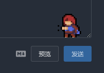
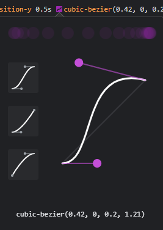
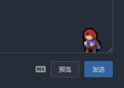

### 写在前面

萌新跌跌撞撞终于把博客弄好了，但发现根本不知道写些什么，，博客就这样吃灰了大半年(哭。

这个假期我心血来潮，决定~~抄一抄~~搞一搞博客。


修改完后执行下述代码以部署:

```bash
hexo clean
hexo g
hexo d
```

建议在`hexo d`部署之前执行下述代码，本地调试一下，网站会在<http://localhost:4000>启动。调试时，修改部分内容(似乎是文件名前有`_`的会忽略掉)不需要重新`hexo g`，重新刷新页面即可生效

```bash
hexo s
```


### 自定义滚动条[<sup>1</sup>](#refer-anchor-1)

效果见右侧滚动条(不支持Firefox和Internet Explorer)

1. 在`博客目录\themes\fluid\source\css`中新建`scrollbar.css`

```css
/*定义滚动条高宽及背景 高宽分别对应横竖滚动条的尺寸*/  
::-webkit-scrollbar {  
    width: 4px;  
    height: 4px;  
    background-color: #181C27;    
}  
 
/*定义滚动条轨道 内阴影+圆角*/  
::-webkit-scrollbar-track {  
    box-shadow: inset 0 0 6px rgba(0,0,0,0.3);  
    -webkit-box-shadow: inset 0 0 6px rgba(0,0,0,0.3);  
    border-radius: 10px;  
    background-color: #181C27;
}  
  
/*定义滑块 内阴影+圆角*/  
::-webkit-scrollbar-thumb {  
    border-radius: 10px;  
    box-shadow: inset 0 0 6px rgba(0,0,0,.3);  
    -webkit-box-shadow: inset 0 0 6px rgba(0,0,0,0.3);  
    background-color: #AAA;  
}

/*鼠标在滑块上方时滑块变色*/  
::-webkit-scrollbar-thumb:hover {
    background-color: #808080;
}

```

2. 在Fluid主题配置文件中添加自定义CSS(195行处)

```yaml
custom_css:
  - /css/scrollbar.css
```

### 首页图片动画[<sup>2</sup>](#refer-anchor-2)


1. 在`博客目录\themes\fluid\source\css`中新建`indeximg-hover.css`

```css
.index-img {
  transition: .4s;           /*动画时间*/
}
.index-card:hover .index-img {
  transform: scale(1.05);    /*放大倍数*/
}
```

2. 在Fluid主题配置文件中添加自定义CSS

```yaml
custom_css:
  - /css/indeximg-hover.css
```

### 自动翻译标题至英文标题

1. 安装插件[hexo-translate-title](https://github.com/cometlj/hexo-translate-title)

```bash
npm install hexo-translate-title --save
```

2. 在hexo根目录的`_config.yml`中添加以下代码

```yaml
translate_title:
  translate_way: google              # google,youdao,baidu_with_appid,baidu_no_appid
  youdao_api_key: ''                 # Your youdao_api_key
  youdao_keyfrom: xxxx-blog          # Your youdao_keyfrom
  is_need_proxy: false               # true | false
  proxy_url: http://localhost:50018  # Your proxy_url
  baidu_appid: ''                    # Your baidu_appid
  baidu_appkey: ''                   # Your baidu_appkey
  rewrite: false                     # is rewrite true | false 
```

3. 修改`_config.yml`中的`permalink`项，将`title`替换为`translate_title`

```yaml
permalink: :year/:month:day/:translate_title.html
```

### Twikoo评论样式修改

按照官方文档部署完[Twikoo](https://twikoo.js.org/quick-start.html)之后，发现默认的评论框高度比较低，没有相关配置选项，所以去找了一下，发现Github有相关问题[issues#106](https://github.com/imaegoo/twikoo/issues/106),开发者的回应是

> 由于Tiwkoo的配置项存在数据库，加载配置有一个延时，经过尝试，将评论框高度放到配置项中，会导致评论框跳动，体验不佳，所以不再考虑评论框高度配置，建议通过外部CSS控制评论框高度。

那么就开干吧，在老位置新建`twikoo.css`，并添加到自定义CSS中

#### 修改评论框高度

开发者给出了相关CSS，实测下来，没什么问题，可以根据自己的喜好更改`min-height`。添加以下代码:

```css
.twikoo .tk-submit .el-textarea__inner {
  min-height: 150px !important;
}
```

#### 去除末尾"Powered by Twikoo"

保留技术支持信息是有必要的，但是为了简洁，还是想办法去除了。你我知道[Twikoo](https://twikoo.js.org/quick-start.html)赛高就可以了哈

```css
.tk-footer {
    display: none;
}
```

#### 为评论框背景图添加动态效果

配置中可以插入自定义图片(静态/动态)，但是不能调整位置，而且当打字时有可能会挡住文字，所以参考资料[<sup>3</sup>](#refer-anchor-2)做出了下面的效果



代码如下:

```css
.twikoo .tk-submit .el-textarea__inner {
    background-position: right 2.5% bottom 0 !important; /*自定义原始位置*/
    transition: all 0.5s ease-in-out 0s !important;      /*动画时间*/
}
.twikoo .tk-submit .el-textarea__inner:focus {
    background-position-y: 240px !important;             /*自定义点击时的位置*/
}
```

后来偶然看到Chrome的F12开发者工具里能调贝塞尔曲线，好像发现了新大陆



于是稍微修改了一下代码，有了下面的效果



总的代码如下:

```css
.tk-footer {
    display: none;
}
.twikoo .tk-submit .el-textarea__inner {
    min-height: 210px !important;
    background-position: right 2.5% bottom 0 !important;
    background-size: 50px 56px !important;
    transition: all 0.3s cubic-bezier(0.42, 0, 0.76, 1.02) 0s, background-position-y 0.5s cubic-bezier(0.42, 0, 0.2, 1.21) 0s !important;

}
.twikoo .tk-submit .el-textarea__inner:focus {
    background-position-y: 240px !important;
    background-size: 10px 56px !important;
}

```

### Mac风格代码块[<sup>4</sup>](#refer-anchor-4)

已经不记得是在哪里复制的代码了，当时直接使用效果不太对，乱调了一通，还是不太懂是怎么实现的，想来想去还是把代码贴出来吧

```css
.code-wrapper {
    position: relative;
    overflow: hidden;
    border-radius: 5px;
    box-shadow: 4px 4px 5px rgba(0,0,0,0.2);
    margin: 25px 0;
    padding-top: 14px;
  }
  .code-wrapper ::-webkit-scrollbar {
    height: 5px;
  }
  .code-wrapper ::-webkit-scrollbar-track {
    -webkit-box-shadow: inset 0 0 6px rgba(0,0,0,0.3);
    box-shadow: inset 0 0 6px rgba(0,0,0,0.3);
    height: 5px;
    border-radius: 10px;
  }
  .code-wrapper ::-webkit-scrollbar-thumb {
    border-radius: 10px;
    height: 5px;
    -webkit-box-shadow: inset 0 0 6px rgba(0,0,0,0.5);
    box-shadow: inset 0 0 6px rgba(0,0,0,0.5);
  }
  .code-wrapper::before {
    color: #fff;
    content: attr(data-rel);
    border-radius: 5px;
    height: 25px;
    line-height: 30px;
    background: #21252b;
    color: #fff;
    font-size: 16px;
    position: absolute;
    top: 0;
    left: 0;
    width: 100%;
    font-family: 'Source Sans Pro', sans-serif;
    font-weight: bold;
    padding: 0 80px;
    text-indent: 15px;
    float: left;
  }
  .code-wrapper::after {
    content: ' ';
    position: absolute;
    -webkit-border-radius: 50%;
    border-radius: 50%;
    background: #fc625d;
    width: 12px;
    height: 12px;
    top: 4px;
    left: 10px;
    margin-top: 4px;
    -webkit-box-shadow: 20px 0px #fdbc40, 40px 0px #35cd4b;
    box-shadow: 20px 0px #fdbc40, 40px 0px #35cd4b;
    z-index: 3;
  }
  .code-wrapper > pre {
    margin-bottom: 0;
  }
  :not(pre) > code[class*="language-"],
  pre[class*="language-"] {
    background: #322931;
  }
  code {
    color: #c4c6c9;
  }
  pre.language-none {
    padding-left: 15px;
  }
  .copy-btn {
    top: 0.3rem!important;
  }
```


### 参考

<div id="refer-anchor-1"></div>

- [1] <https://blog.csdn.net/qq_35588633/article/details/80604459>

<div id="refer-anchor-2"></div>

- [2] <https://blog.jalenchuh.cn/posts/hexo-fluid/>

<div id="refer-anchor-3"></div>

- [3] <https://bestzuo.cn/posts/763113948.html>

<div id="refer-anchor-4"></div>

- [4] <https://tomorrow505.xyz/Hexo-Fluid%E5%AE%9E%E7%8E%B0mac-panel%E9%A3%8E%E6%A0%BC%E4%BB%A3%E7%A0%81%E5%9D%97/>